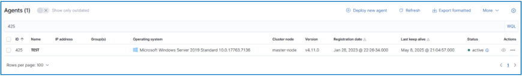

# Wazuh Agent Enrollment using Password Authentication Method

Wazuh agent enrollment is the procedure of registering a Wazuh agent with a Wazuh manager, enabling secure communication and integration into the Wazuh security ecosystem.

Through this enrollment process:

* The Wazuh manager registers agents and assigns them unique client keys.

* These client keys are used to encrypt communications between the agent and the manager.

* The manager verifies the identity of each agent attempting to connect.

* Once enrolled, the agent gathers security data from its host system and transmits it to the Wazuh manager for processing and analysis.

## Prerequisite

To successfully complete Wazuh agent enrollment, the following prerequisites must be met:

* A Wazuh manager must be installed and actively running.

* The target endpoint must have a Wazuh agent installed and operational.

* The Wazuh agent must be able to establish outbound connections to the Wazuh manager’s services. This requires the following configurable ports to be open:

    * TCP port 1514 for agent-to-manager communication
    * TCP port 1515 for automatic enrollment requests
    * TCP port 55000 for enrollment through the Wazuh server API

## Enable Password Authentication

### Configuration inside Wazuh Manager Node

1. Enable the password authentication at `<auth>` section inside the Wazuh Manager configuration file `/var/ossec/etc/ossec.conf`.

```
<auth>
    <use_password>yes</use_password>
</auth>
```

2. Set the password for the authentication by creating the
`/var/ossec/etc/authd.pass` file and put the password inside it.

```bash
echo “packlahcode” > /var/ossec/etc/authd.pass
```

3. Change the `authd.pass` file permission and ownership.

```bash
chmod 640 /var/ossec/etc/authd.pass
chown root:wazuh /var/ossec/etc/authd.pass
```

4. Restart Wazuh Manager service for the changes to take effect.

```bash
systemctl restart wazuh-manager
```

## Wazuh Agent Enrollment

The simplest method to enroll a Wazuh agent is by retrieving the enrollment command directly from the Wazuh dashboard.

1. Go to `Agents Management` > `Summary`.


2. Select `Deploy new agent`.


3. Choose the `OS` that the endpoint used to install the Wazuh agent. Might be `Windows`, `Linux` or `MacOS`.


4. Set the `Wazuh Manager` address for the agent to communicate. If using `distributed deployment`, set the `Load Balancer` address here.


5. By default, the agent will be using the endpoint hostname as the agent's name, but we can assign a dedicated name for it. We also can assign groups for the agent for easy management.


6. Once everything has been filled up, we `will get the command` to enroll the Wazuh agent inside our endpoint. We can see there is Wazuh registration password included inside the command. After running the enroll command, we will need to `restart the Wazuh agent service` for the changes to take effect.


Sample command:

```sh
Invoke-WebRequest -Uri https://packages.wazuh.com/4.x/windows/wazuh-agent-4.11.2-1.msi -OutFile $env:tmp\wazuh-agent; msiexec.exe /i $env:tmp\wazuh-agent /q WAZUH_MANAGER='192.168.100.10' WAZUH_REGISTRATION_PASSWORD='testing123' WAZUH_AGENT_GROUP='default,windows' WAZUH_AGENT_NAME='Windows-Agent'
```

7. At this point, the newly enrolled Wazuh agent appears in the Wazuh Dashboard with an `online` status, indicating that the enrollment was successful.



### You have successfully enroll a Wazuh agent into Wazuh SIEM 😍😍😍

## Need Help To Deploy Wazuh? Reach me here

  * [Deploy Wazuh For Me](https://www.fiverr.com/packlah/install-wazuh-siem-for-you?context_referrer=tailored_homepage_perseus&source=recently_viewed_gigs&ref_ctx_id=e68c8431b0214894a1726eb5d672a5d6&context=recommendation&pckg_id=1&pos=1&context_alg=recently_viewed&seller_online=true&imp_id=55407c12-acb7-480d-9ad6-3d480322d433) 